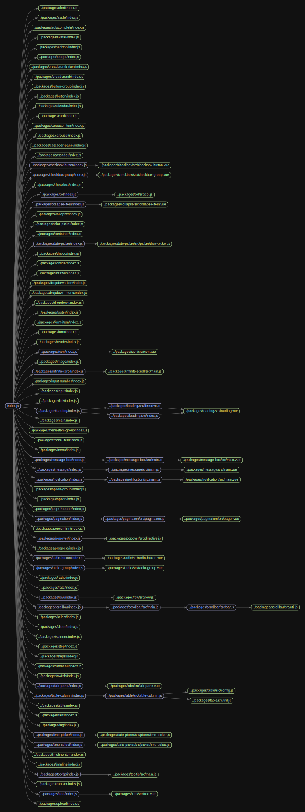

# 源码分析

基于原始的vue和纯粹的javascript构建，scss单独分开管理。

## 文件结构

``` bash
/Users/liufang/openSource/FunnyLiu/element
├── build - 打包相关脚本，暂时忽略
├── packages - 具体的每个组件
|  ├── alert
|  |  ├── index.js
|  |  └── src
|  |     └── main.vue
|  ├── aside
|  |  ├── index.js
|  |  └── src
|  |     └── main.vue  - el-aside 简单的嵌入slot
|  ├── autocomplete
|  |  ├── index.js
|  |  └── src
|  |     ├── autocomplete-suggestions.vue
|  |     └── autocomplete.vue
|  ├── avatar
|  |  ├── index.js
|  |  └── src
|  |     └── main.vue
|  ├── backtop
|  |  ├── index.js
|  |  └── src
|  |     └── main.vue
|  ├── badge
|  |  ├── index.js
|  |  └── src
|  |     └── main.vue
|  ├── breadcrumb
|  |  ├── index.js
|  |  └── src
|  |     ├── breadcrumb-item.vue
|  |     └── breadcrumb.vue
|  ├── breadcrumb-item
|  |  └── index.js
|  ├── button
|  |  ├── index.js 
|  |  └── src
|  |     ├── button-group.vue - el-button-group组件，简单嵌入slot
|  |     └── button.vue - el-button按钮组件，通过inject接收elForm和elFormItem属性，对外抛事件
|  ├── button-group
|  |  └── index.js
|  ├── calendar
|  |  ├── index.js
|  |  └── src
|  |     ├── date-table.vue
|  |     └── main.vue
|  ├── card
|  |  ├── index.js
|  |  └── src
|  |     └── main.vue
|  ├── carousel
|  |  ├── index.js
|  |  └── src
|  |     ├── item.vue
|  |     └── main.vue
|  ├── carousel-item
|  |  └── index.js
|  ├── cascader
|  |  ├── index.js
|  |  └── src
|  |     └── cascader.vue
|  ├── cascader-panel
|  |  ├── index.js
|  |  └── src
|  |     ├── cascader-menu.vue
|  |     ├── cascader-node.vue
|  |     ├── cascader-panel.vue
|  |     ├── node.js
|  |     └── store.js
|  ├── checkbox
|  |  ├── index.js
|  |  └── src
|  |     ├── checkbox-button.vue
|  |     ├── checkbox-group.vue
|  |     └── checkbox.vue
|  ├── checkbox-button
|  |  └── index.js
|  ├── checkbox-group
|  |  └── index.js
|  ├── col
|  |  ├── index.js
|  |  └── src
|  |     └── col.js - el-col，通过递归找到上一层父亲el-row的gutter属性。
|  ├── collapse
|  |  ├── index.js
|  |  └── src
|  |     ├── collapse-item.vue
|  |     └── collapse.vue
|  ├── collapse-item
|  |  └── index.js
|  ├── color-picker
|  |  ├── index.js
|  |  └── src
|  |     ├── color.js
|  |     ├── components
|  |     |  ├── alpha-slider.vue
|  |     |  ├── hue-slider.vue
|  |     |  ├── picker-dropdown.vue
|  |     |  ├── predefine.vue
|  |     |  └── sv-panel.vue
|  |     ├── draggable.js
|  |     └── main.vue
|  ├── container
|  |  ├── index.js
|  |  └── src
|  |     └── main.vue - el-container组件，通过this.$slots.default上vnode.componentOptions.tag判断子内容中是否存在某些子组件，从而定制化样式
|  ├── date-picker
|  |  ├── index.js
|  |  └── src
|  |     ├── basic
|  |     |  ├── date-table.vue
|  |     |  ├── month-table.vue
|  |     |  ├── time-spinner.vue
|  |     |  └── year-table.vue
|  |     ├── panel
|  |     |  ├── date-range.vue
|  |     |  ├── date.vue
|  |     |  ├── month-range.vue
|  |     |  ├── time-range.vue
|  |     |  ├── time-select.vue
|  |     |  └── time.vue
|  |     ├── picker
|  |     |  ├── date-picker.js
|  |     |  ├── time-picker.js
|  |     |  └── time-select.js
|  |     └── picker.vue
|  ├── dialog
|  |  ├── index.js
|  |  └── src
|  |     └── component.vue
|  ├── divider
|  |  ├── index.js
|  |  └── src
|  |     └── main.vue
|  ├── drawer
|  |  ├── index.js
|  |  └── src
|  |     └── main.vue
|  ├── dropdown
|  |  ├── index.js
|  |  └── src
|  |     ├── dropdown-item.vue
|  |     ├── dropdown-menu.vue
|  |     └── dropdown.vue
|  ├── dropdown-item
|  |  └── index.js
|  ├── dropdown-menu
|  |  └── index.js
|  ├── footer
|  |  ├── index.js
|  |  └── src
|  |     └── main.vue - el-footer组件，简单的嵌入slot
|  ├── form
|  |  ├── index.js
|  |  └── src
|  |     ├── form-item.vue
|  |     ├── form.vue
|  |     └── label-wrap.vue
|  ├── form-item
|  |  └── index.js
|  ├── header
|  |  ├── index.js
|  |  └── src
|  |     └── main.vue - el-header组件，简单的嵌入slot
|  ├── icon
|  |  ├── index.js
|  |  └── src
|  |     └── icon.vue
|  ├── image
|  |  ├── index.js
|  |  └── src
|  |     ├── image-viewer.vue
|  |     └── main.vue
|  ├── infinite-scroll
|  |  ├── index.js
|  |  └── src
|  |     └── main.js
|  ├── input
|  |  ├── index.js
|  |  └── src
|  |     ├── calcTextareaHeight.js
|  |     └── input.vue
|  ├── input-number
|  |  ├── index.js
|  |  └── src
|  |     └── input-number.vue
|  ├── link
|  |  ├── index.js
|  |  └── src
|  |     └── main.vue - el-link组件，兼容slot内容和slot图标，通过$attrs传递属性给下层
|  ├── loading
|  |  ├── index.js
|  |  └── src
|  |     ├── directive.js
|  |     ├── index.js
|  |     └── loading.vue
|  ├── main
|  |  ├── index.js
|  |  └── src
|  |     └── main.vue - el-main组件，简单的嵌入slot
|  ├── menu
|  |  ├── index.js
|  |  └── src
|  |     ├── menu-item-group.vue
|  |     ├── menu-item.vue
|  |     ├── menu-mixin.js
|  |     ├── menu.vue
|  |     └── submenu.vue
|  ├── menu-item
|  |  └── index.js
|  ├── menu-item-group
|  |  └── index.js
|  ├── message
|  |  ├── index.js
|  |  └── src
|  |     ├── main.js
|  |     └── main.vue
|  ├── message-box
|  |  ├── index.js
|  |  └── src
|  |     ├── main.js
|  |     └── main.vue
|  ├── notification
|  |  ├── index.js
|  |  └── src
|  |     ├── main.js
|  |     └── main.vue
|  ├── option
|  |  └── index.js
|  ├── option-group
|  |  └── index.js
|  ├── page-header
|  |  ├── index.js
|  |  └── src
|  |     └── main.vue
|  ├── pagination
|  |  ├── index.js
|  |  └── src
|  |     ├── pager.vue
|  |     └── pagination.js
|  ├── popconfirm
|  |  ├── index.js
|  |  └── src
|  |     └── main.vue
|  ├── popover
|  |  ├── index.js
|  |  └── src
|  |     ├── directive.js
|  |     └── main.vue
|  ├── progress
|  |  ├── index.js
|  |  └── src
|  |     └── progress.vue
|  ├── radio
|  |  ├── index.js
|  |  └── src
|  |     ├── radio-button.vue
|  |     ├── radio-group.vue
|  |     └── radio.vue
|  ├── radio-button
|  |  └── index.js
|  ├── radio-group
|  |  └── index.js
|  ├── rate
|  |  ├── index.js
|  |  └── src
|  |     └── main.vue
|  ├── row
|  |  ├── index.js - el-row，通过render创建自定义dom，内容为$slots.default
|  |  └── src
|  |     └── row.js
|  ├── scrollbar
|  |  ├── index.js
|  |  └── src
|  |     ├── bar.js
|  |     ├── main.js
|  |     └── util.js
|  ├── select
|  |  ├── index.js
|  |  └── src
|  |     ├── navigation-mixin.js
|  |     ├── option-group.vue
|  |     ├── option.vue
|  |     ├── select-dropdown.vue
|  |     └── select.vue
|  ├── slider
|  |  ├── index.js
|  |  └── src
|  |     ├── button.vue
|  |     ├── main.vue
|  |     └── marker.js
|  ├── spinner
|  |  ├── index.js
|  |  └── src
|  |     └── spinner.vue
|  ├── step
|  |  └── index.js
|  ├── steps
|  |  ├── README.md
|  |  ├── index.js
|  |  └── src
|  |     ├── step.vue
|  |     └── steps.vue
|  ├── submenu
|  |  └── index.js
|  ├── switch
|  |  ├── index.js
|  |  └── src
|  |     └── component.vue
|  ├── tab-pane
|  |  └── index.js
|  ├── table
|  |  ├── index.js
|  |  └── src
|  |     ├── config.js
|  |     ├── dropdown.js
|  |     ├── filter-panel.vue
|  |     ├── layout-observer.js
|  |     ├── store
|  |     |  ├── current.js
|  |     |  ├── expand.js
|  |     |  ├── helper.js
|  |     |  ├── index.js
|  |     |  ├── tree.js
|  |     |  └── watcher.js
|  |     ├── table-body.js
|  |     ├── table-column.js
|  |     ├── table-footer.js
|  |     ├── table-header.js
|  |     ├── table-layout.js
|  |     ├── table.vue
|  |     └── util.js
|  ├── table-column
|  |  └── index.js
|  ├── tabs
|  |  ├── index.js
|  |  └── src
|  |     ├── tab-bar.vue
|  |     ├── tab-nav.vue
|  |     ├── tab-pane.vue
|  |     └── tabs.vue
|  ├── tag
|  |  ├── index.js
|  |  └── src
|  |     └── tag.vue
|  ├── theme-chalk
|  |  ├── README.md
|  |  ├── gulpfile.js
|  |  ├── package.json
|  |  └── src
|  |     ├── alert.scss
|  |     ├── aside.scss
|  |     ├── autocomplete.scss
|  |     ├── avatar.scss
|  |     ├── backtop.scss
|  |     ├── badge.scss
|  |     ├── base.scss
|  |     ├── breadcrumb-item.scss
|  |     ├── breadcrumb.scss
|  |     ├── button-group.scss
|  |     ├── button.scss
|  |     ├── calendar.scss
|  |     ├── card.scss
|  |     ├── carousel-item.scss
|  |     ├── carousel.scss
|  |     ├── cascader-panel.scss
|  |     ├── cascader.scss
|  |     ├── checkbox-button.scss
|  |     ├── checkbox-group.scss
|  |     ├── checkbox.scss
|  |     ├── col.scss
|  |     ├── collapse-item.scss
|  |     ├── collapse.scss
|  |     ├── color-picker.scss
|  |     ├── common
|  |     |  ├── popup.scss
|  |     |  ├── transition.scss
|  |     |  └── var.scss
|  |     ├── container.scss
|  |     ├── date-picker
|  |     |  ├── date-picker.scss
|  |     |  ├── date-range-picker.scss
|  |     |  ├── date-table.scss
|  |     |  ├── month-table.scss
|  |     |  ├── picker-panel.scss
|  |     |  ├── picker.scss
|  |     |  ├── time-picker.scss
|  |     |  ├── time-range-picker.scss
|  |     |  ├── time-spinner.scss
|  |     |  └── year-table.scss
|  |     ├── date-picker.scss
|  |     ├── dialog.scss
|  |     ├── display.scss
|  |     ├── divider.scss
|  |     ├── drawer.scss
|  |     ├── dropdown-item.scss
|  |     ├── dropdown-menu.scss
|  |     ├── dropdown.scss
|  |     ├── fonts
|  |     |  ├── element-icons.ttf
|  |     |  └── element-icons.woff
|  |     ├── footer.scss
|  |     ├── form-item.scss
|  |     ├── form.scss
|  |     ├── header.scss
|  |     ├── icon.scss
|  |     ├── image.scss
|  |     ├── index.scss
|  |     ├── infinite-scroll.scss
|  |     ├── infiniteScroll.scss
|  |     ├── input-number.scss
|  |     ├── input.scss
|  |     ├── link.scss
|  |     ├── loading.scss
|  |     ├── main.scss
|  |     ├── menu-item-group.scss
|  |     ├── menu-item.scss
|  |     ├── menu.scss
|  |     ├── message-box.scss
|  |     ├── message.scss
|  |     ├── mixins
|  |     |  ├── _button.scss
|  |     |  ├── config.scss
|  |     |  ├── function.scss
|  |     |  ├── mixins.scss
|  |     |  └── utils.scss
|  |     ├── notification.scss
|  |     ├── option-group.scss
|  |     ├── option.scss
|  |     ├── page-header.scss
|  |     ├── pagination.scss
|  |     ├── popconfirm.scss
|  |     ├── popover.scss
|  |     ├── popper.scss
|  |     ├── progress.scss
|  |     ├── radio-button.scss
|  |     ├── radio-group.scss
|  |     ├── radio.scss
|  |     ├── rate.scss
|  |     ├── reset.scss
|  |     ├── row.scss
|  |     ├── scrollbar.scss
|  |     ├── select-dropdown.scss
|  |     ├── select.scss
|  |     ├── slider.scss
|  |     ├── spinner.scss
|  |     ├── step.scss
|  |     ├── steps.scss
|  |     ├── submenu.scss
|  |     ├── switch.scss
|  |     ├── tab-pane.scss
|  |     ├── table-column.scss
|  |     ├── table.scss
|  |     ├── tabs.scss
|  |     ├── tag.scss
|  |     ├── time-picker.scss
|  |     ├── time-select.scss
|  |     ├── timeline-item.scss
|  |     ├── timeline.scss
|  |     ├── tooltip.scss
|  |     ├── transfer.scss
|  |     ├── tree.scss
|  |     └── upload.scss
|  ├── time-picker
|  |  └── index.js
|  ├── time-select
|  |  └── index.js
|  ├── timeline
|  |  ├── index.js
|  |  └── src
|  |     ├── item.vue
|  |     └── main.vue
|  ├── timeline-item
|  |  └── index.js
|  ├── tooltip
|  |  ├── index.js
|  |  └── src
|  |     └── main.js
|  ├── transfer
|  |  ├── index.js
|  |  └── src
|  |     ├── main.vue
|  |     └── transfer-panel.vue
|  ├── tree
|  |  ├── index.js
|  |  └── src
|  |     ├── model
|  |     |  ├── node.js
|  |     |  ├── tree-store.js
|  |     |  └── util.js
|  |     ├── tree-node.vue
|  |     └── tree.vue
|  └── upload
|     ├── index.js
|     └── src
|        ├── ajax.js
|        ├── index.vue
|        ├── upload-dragger.vue
|        ├── upload-list.vue
|        └── upload.vue
├── src
|  ├── directives
|  |  ├── mousewheel.js
|  |  └── repeat-click.js
|  ├── index.js - 提供install方法，作为vue插件，注册packages文件夹下的所有组件
|  ├── locale
|  |  ├── format.js
|  |  ├── index.js
|  |  └── lang - 国际化语言包
|  ├── mixins
|  |  ├── emitter.js
|  |  ├── focus.js
|  |  ├── locale.js
|  |  └── migrating.js
|  ├── transitions
|  |  └── collapse-transition.js
|  └── utils
|     ├── after-leave.js
|     ├── aria-dialog.js
|     ├── aria-utils.js
|     ├── clickoutside.js
|     ├── date-util.js
|     ├── date.js
|     ├── dom.js
|     ├── menu
|     |  ├── aria-menubar.js
|     |  ├── aria-menuitem.js
|     |  └── aria-submenu.js
|     ├── merge.js
|     ├── popper.js
|     ├── popup
|     |  ├── index.js
|     |  └── popup-manager.js
|     ├── resize-event.js
|     ├── scroll-into-view.js
|     ├── scrollbar-width.js
|     ├── shared.js
|     ├── types.js
|     ├── util.js
|     ├── vdom.js
|     └── vue-popper.js
├── types
|  ├── alert.d.ts
|  ├── aside.d.ts
|  ├── autocomplete.d.ts
|  ├── avatar.d.ts
|  ├── backtop.d.ts
|  ├── badge.d.ts
|  ├── breadcrumb-item.d.ts
|  ├── breadcrumb.d.ts
|  ├── button-group.d.ts
|  ├── button.d.ts
|  ├── calendar.d.ts
|  ├── card.d.ts
|  ├── carousel-item.d.ts
|  ├── carousel.d.ts
|  ├── cascader-panel.d.ts
|  ├── cascader.d.ts
|  ├── checkbox-button.d.ts
|  ├── checkbox-group.d.ts
|  ├── checkbox.d.ts
|  ├── col.d.ts
|  ├── collapse-item.d.ts
|  ├── collapse.d.ts
|  ├── color-picker.d.ts
|  ├── component.d.ts
|  ├── container.d.ts
|  ├── date-picker.d.ts
|  ├── dialog.d.ts
|  ├── divider.d.ts
|  ├── drawer.d.ts
|  ├── dropdown-item.d.ts
|  ├── dropdown-menu.d.ts
|  ├── dropdown.d.ts
|  ├── element-ui.d.ts
|  ├── footer.d.ts
|  ├── form-item.d.ts
|  ├── form.d.ts
|  ├── header.d.ts
|  ├── icon.d.ts
|  ├── image.d.ts
|  ├── index.d.ts
|  ├── infinite-scroll.d.ts
|  ├── input-number.d.ts
|  ├── input.d.ts
|  ├── link.d.ts
|  ├── loading.d.ts
|  ├── main.d.ts
|  ├── menu-item-group.d.ts
|  ├── menu-item.d.ts
|  ├── menu.d.ts
|  ├── message-box.d.ts
|  ├── message.d.ts
|  ├── notification.d.ts
|  ├── option-group.d.ts
|  ├── option.d.ts
|  ├── page-header.d.ts
|  ├── pagination.d.ts
|  ├── popconfirm.d.ts
|  ├── popover.d.ts
|  ├── progress.d.ts
|  ├── radio-button.d.ts
|  ├── radio-group.d.ts
|  ├── radio.d.ts
|  ├── rate.d.ts
|  ├── row.d.ts
|  ├── select.d.ts
|  ├── slider.d.ts
|  ├── step.d.ts
|  ├── steps.d.ts
|  ├── submenu.d.ts
|  ├── switch.d.ts
|  ├── tab-pane.d.ts
|  ├── table-column.d.ts
|  ├── table.d.ts
|  ├── tabs.d.ts
|  ├── tag.d.ts
|  ├── time-picker.d.ts
|  ├── time-select.d.ts
|  ├── timeline-item.d.ts
|  ├── timeline.d.ts
|  ├── tooltip.d.ts
|  ├── transfer.d.ts
|  ├── tree.d.ts
|  └── upload.d.ts
└── yarn.lock

directory: 201 file: 1053

ignored: directory (1)

```

## 外部模块依赖

请在： http://npm.broofa.com?q=element-ui 查看

## 内部模块依赖


  


<p align="center">
  
</p>

<p align="center">
  <a href="https://travis-ci.org/ElemeFE/element">
    
  </a>
  <a href="https://coveralls.io/github/ElemeFE/element?branch=master">
    
  </a>
  <a href="https://cdnjs.com/libraries/element-ui">
    
  </a>
  <a href="https://www.npmjs.org/package/element-ui">
    
  </a>
  <a href="https://npmcharts.com/compare/element-ui?minimal=true">
    
  </a>
  <br>
  <a href="http://img.badgesize.io/https://unpkg.com/element-ui/lib/index.js?compression=gzip&label=gzip%20size:%20JS">
    
  </a>
  <a href="http://img.badgesize.io/https://unpkg.com/element-ui/lib/theme-chalk/index.css?compression=gzip&label=gzip%20size:%20CSS">
    
  </a>
  <a href="#backers">
    
  </a>
  <a href="#sponsors">
    
  </a>
  <a href="LICENSE">
    
  </a>
</p>

<p align="center">
  <b>Special thanks to the generous sponsorship by:</b>
</p>
<table>
  <tbody>
    <tr>
      <td align="center" valign="middle">
        <a href="https://tipe.io/?ref=element" target="_blank">
          
        </a>
      </td>
      <td align="center" valign="middle">
        <a href="https://www.duohui.cn/?utm_source=element&utm_medium=web&utm_campaign=element-index" target="_blank">
          
        </a>
      </td>
      <td align="center" valign="middle">
        <a href="https://bitsrc.io/" target="_blank">
          
        </a>
      </td>
    </tr>
  </tbody>
</table>

> A Vue.js 2.0 UI Toolkit for Web.

## Links
- Homepage and documentation
  - [International users](http://element.eleme.io/#/en-US)
  - [Chinese users](http://element-cn.eleme.io/#/zh-CN)
  - [Spanish users](http://element.eleme.io/#/es)
  - [French users](http://element.eleme.io/#/fr-FR)
- [awesome-element](https://github.com/ElementUI/awesome-element)
- [FAQ](./FAQ.md)
- [Customize theme](http://element.eleme.io/#/en-US/component/custom-theme)
- [Preview and generate theme online](https://elementui.github.io/theme-chalk-preview)
- [Element for React](https://github.com/elemefe/element-react)
- [Element for Angular](https://github.com/ElemeFE/element-angular)
- [Atom helper](https://github.com/ElemeFE/element-helper)
- [Visual Studio Code helper](https://github.com/ElemeFE/vscode-element-helper)
- Starter kit
  - [element-starter](https://github.com/ElementUI/element-starter)
  - [element-in-laravel-starter](https://github.com/ElementUI/element-in-laravel-starter)
- [Design resources](https://github.com/ElementUI/Resources)
- Gitter
  - [International users](https://gitter.im/element-en/Lobby)
  - [Chinese users](https://gitter.im/ElemeFE/element)

## Install
```shell
npm install element-ui -S
```

## Quick Start
``` javascript
import Vue from 'vue'
import Element from 'element-ui'

Vue.use(Element)

// or
import {
  Select,
  Button
  // ...
} from 'element-ui'

Vue.component(Select.name, Select)
Vue.component(Button.name, Button)
```
For more information, please refer to [Quick Start](http://element.eleme.io/#/en-US/component/quickstart) in our documentation.

## Browser Support
Modern browsers and Internet Explorer 10+.

## Development
Skip this part if you just want to use Element.

For those who are interested in contributing to Element, please refer to our contributing guide ([中文](https://github.com/ElemeFE/element/blob/master/.github/CONTRIBUTING.zh-CN.md) | [English](https://github.com/ElemeFE/element/blob/master/.github/CONTRIBUTING.en-US.md) | [Español](https://github.com/ElemeFE/element/blob/master/.github/CONTRIBUTING.es.md) | [Français](https://github.com/ElemeFE/element/blob/master/.github/CONTRIBUTING.fr-FR.md)) to see how to run this project.

## Changelog
Detailed changes for each release are documented in the [release notes](https://github.com/ElemeFE/element/releases).

## FAQ
We have collected some [frequently asked questions](https://github.com/ElemeFE/element/blob/master/FAQ.md). Before reporting an issue, please search if the FAQ has the answer to your problem.

## Contribution
Please make sure to read the contributing guide ([中文](https://github.com/ElemeFE/element/blob/master/.github/CONTRIBUTING.zh-CN.md) | [English](https://github.com/ElemeFE/element/blob/master/.github/CONTRIBUTING.en-US.md) | [Español](https://github.com/ElemeFE/element/blob/master/.github/CONTRIBUTING.es.md) | [Français](https://github.com/ElemeFE/element/blob/master/.github/CONTRIBUTING.fr-FR.md)) before making a pull request.

[](https://issuehunt.io/repos/67274736)

## Special Thanks
English documentation is brought to you by SwiftGG Translation Team:
- [raychenfj](https://github.com/raychenfj)
- [kevin](http://thekevin.cn/)
- [曾小涛](https://github.com/zengxiaotao)
- [湾仔王二](https://github.com/wanzaiwanger)
- [BlooDLine](http://www.ibloodline.com/)
- [陈铭嘉](https://chenmingjia.github.io/)
- [千叶知风](http://mpc6.com/)
- [梁杰](http://numbbbbb.com)
- [Changing](https://github.com/sunzhuo11)
- [mmoaay](https://github.com/mmoaay)

Spanish documentation is made possible by these community developers:
- [adavie1](https://github.com/adavie1)
- [carmencitaqiu](https://github.com/carmencitaqiu)
- [coderdiaz](https://github.com/coderdiaz)
- [fedegar33](https://github.com/fedegar33)
- [Gonzalo2310](https://github.com/Gonzalo2310)
- [lesterbx](https://github.com/lesterbx)
- [ProgramerGuy](https://github.com/ProgramerGuy)
- [SantiagoGdaR](https://github.com/SantiagoGdaR)
- [sigfriedCub1990](https://github.com/sigfriedCub1990)
- [thechosenjuan](https://github.com/thechosenjuan)

French documentation is made possible by these community developers:
- [smalesys](https://github.com/smalesys)
- [blombard](https://github.com/blombard)

## Donation
If you find Element useful, you can buy us a cup of coffee


## Backers

Support us with a monthly donation and help us continue our activities. [[Become a backer](https://opencollective.com/element#backer)]

<a href="https://opencollective.com/element/backer/0/website" target="_blank"></a>
<a href="https://opencollective.com/element/backer/1/website" target="_blank"></a>
<a href="https://opencollective.com/element/backer/2/website" target="_blank"></a>
<a href="https://opencollective.com/element/backer/3/website" target="_blank"></a>
<a href="https://opencollective.com/element/backer/4/website" target="_blank"></a>
<a href="https://opencollective.com/element/backer/5/website" target="_blank"></a>
<a href="https://opencollective.com/element/backer/6/website" target="_blank"></a>
<a href="https://opencollective.com/element/backer/7/website" target="_blank"></a>
<a href="https://opencollective.com/element/backer/8/website" target="_blank"></a>
<a href="https://opencollective.com/element/backer/9/website" target="_blank"></a>
<a href="https://opencollective.com/element/backer/10/website" target="_blank"></a>
<a href="https://opencollective.com/element/backer/11/website" target="_blank"></a>
<a href="https://opencollective.com/element/backer/12/website" target="_blank"></a>
<a href="https://opencollective.com/element/backer/13/website" target="_blank"></a>
<a href="https://opencollective.com/element/backer/14/website" target="_blank"></a>
<a href="https://opencollective.com/element/backer/15/website" target="_blank"></a>
<a href="https://opencollective.com/element/backer/16/website" target="_blank"></a>
<a href="https://opencollective.com/element/backer/17/website" target="_blank"></a>
<a href="https://opencollective.com/element/backer/18/website" target="_blank"></a>
<a href="https://opencollective.com/element/backer/19/website" target="_blank"></a>
<a href="https://opencollective.com/element/backer/20/website" target="_blank"></a>
<a href="https://opencollective.com/element/backer/21/website" target="_blank"></a>
<a href="https://opencollective.com/element/backer/22/website" target="_blank"></a>
<a href="https://opencollective.com/element/backer/23/website" target="_blank"></a>
<a href="https://opencollective.com/element/backer/24/website" target="_blank"></a>
<a href="https://opencollective.com/element/backer/25/website" target="_blank"></a>
<a href="https://opencollective.com/element/backer/26/website" target="_blank"></a>
<a href="https://opencollective.com/element/backer/27/website" target="_blank"></a>
<a href="https://opencollective.com/element/backer/28/website" target="_blank"></a>
<a href="https://opencollective.com/element/backer/29/website" target="_blank"></a>


## Sponsors

Become a sponsor and get your logo on our README on Github with a link to your site. [[Become a sponsor](https://opencollective.com/element#sponsor)]

<a href="https://opencollective.com/element/sponsor/0/website" target="_blank"></a>
<a href="https://opencollective.com/element/sponsor/1/website" target="_blank"></a>
<a href="https://opencollective.com/element/sponsor/2/website" target="_blank"></a>
<a href="https://opencollective.com/element/sponsor/3/website" target="_blank"></a>
<a href="https://opencollective.com/element/sponsor/4/website" target="_blank"></a>
<a href="https://opencollective.com/element/sponsor/5/website" target="_blank"></a>
<a href="https://opencollective.com/element/sponsor/6/website" target="_blank"></a>
<a href="https://opencollective.com/element/sponsor/7/website" target="_blank"></a>
<a href="https://opencollective.com/element/sponsor/8/website" target="_blank"></a>
<a href="https://opencollective.com/element/sponsor/9/website" target="_blank"></a>
<a href="https://opencollective.com/element/sponsor/10/website" target="_blank"></a>
<a href="https://opencollective.com/element/sponsor/11/website" target="_blank"></a>
<a href="https://opencollective.com/element/sponsor/12/website" target="_blank"></a>
<a href="https://opencollective.com/element/sponsor/13/website" target="_blank"></a>
<a href="https://opencollective.com/element/sponsor/14/website" target="_blank"></a>
<a href="https://opencollective.com/element/sponsor/15/website" target="_blank"></a>
<a href="https://opencollective.com/element/sponsor/16/website" target="_blank"></a>
<a href="https://opencollective.com/element/sponsor/17/website" target="_blank"></a>
<a href="https://opencollective.com/element/sponsor/18/website" target="_blank"></a>
<a href="https://opencollective.com/element/sponsor/19/website" target="_blank"></a>
<a href="https://opencollective.com/element/sponsor/20/website" target="_blank"></a>
<a href="https://opencollective.com/element/sponsor/21/website" target="_blank"></a>
<a href="https://opencollective.com/element/sponsor/22/website" target="_blank"></a>
<a href="https://opencollective.com/element/sponsor/23/website" target="_blank"></a>
<a href="https://opencollective.com/element/sponsor/24/website" target="_blank"></a>
<a href="https://opencollective.com/element/sponsor/25/website" target="_blank"></a>
<a href="https://opencollective.com/element/sponsor/26/website" target="_blank"></a>
<a href="https://opencollective.com/element/sponsor/27/website" target="_blank"></a>
<a href="https://opencollective.com/element/sponsor/28/website" target="_blank"></a>
<a href="https://opencollective.com/element/sponsor/29/website" target="_blank"></a>

## Join Discussion Group

Scan the QR code using [Dingtalk App](https://www.dingtalk.com/) to join in discussion group :


## LICENSE
[MIT](LICENSE)
